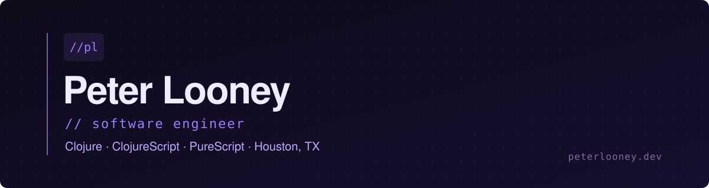

----

Full-stack engineer with 5+ years of professional experience in **Clojure**, **ClojureScript**, and **PureScript**, building production systems in functional languages. I like greenfield work, careful migrations, and tools that respect the people using them.

- 🏗️ Currently at **Panoramic Software**, working primarily in **PureScript** on integrations with enterprise systems.
- 🩺 Previously spent nearly four years at **Luminare** working across the stack in **Clojure / ClojureScript** on healthcare products, including a greenfield build, a SPA-to-SSR migration, and a Python decision-engine project with **Mayo Clinic**.
- 🛠️ Outside of work I run a self-hosted home server stack, maintain a few open source Clojure libraries, and tinker with hardware projects.

<!-- <code>// projects</code>

**[nectar-sql](https://github.com/plooney81/nectar-sql)** · <code>Clojure library</code> 
Parses raw SQL strings into HoneySQL data structures using JSQLParser. Supports `SELECT`, `INSERT`, `UPDATE`, and `DELETE` queries. Published to Clojars and ships with a [live in-browser demo ↗](https://nectar-sql.com).

**[HoneySQL](https://github.com/seancorfield/honeysql)** · <code>Open source contributor</code> 
Contributor to `seancorfield/honeysql`, the widely used Clojure library for building SQL statements as data structures.

<code>// skills</code> -->
----
**Languages** 

**Frameworks** 

**Backend & Data** 

**Tooling** 

----

I'm always interested in conversations about functional programming, healthcare software, and developer tools.

